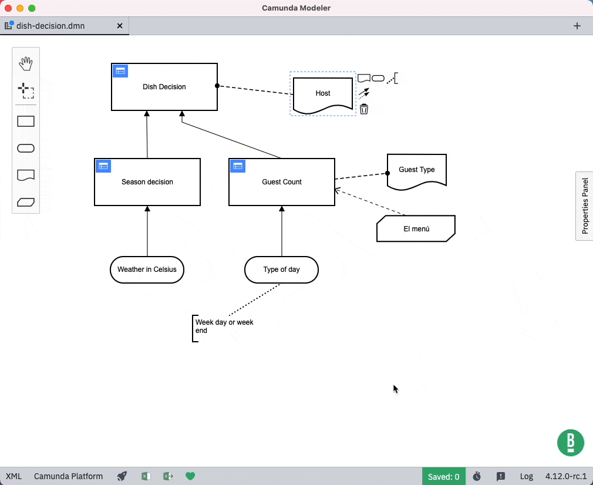

# camunda-modeler-autosave-plugin


[](https://github.com/camunda/camunda-modeler)

This offers an *auto save mechanism* to save your diagram changes after a defined amount of time.

This includes an example plugin on how to extend the [Camunda Modeler](https://github.com/camunda/camunda-modeler) user interface as [React](https://reactjs.org/) component.



## How to use

1. Download and copy this repository into the `plugins` directory of the Camunda Modeler
2. Start the Camunda Modeler
3. Enable and configure auto save mechanism via Modal

Refer to the [plugins documentation](https://github.com/camunda/camunda-modeler/tree/master/docs/plugins#plugging-into-the-camunda-modeler) to get detailed information on how to create and integrate Camunda Modeler plugins.

## Development Setup

Firstly, clone this repository to your machine
```bash
$ git clone https://github.com/pinussilvestrus/camunda-modeler-autosave-plugin.git
$ cd camunda-modeler-autosave-plugin
```

Install all dependencies

```bash
$ npm install
```

To work properly inside the Camunda Modeler this plugin needs to be bundled.

```bash
$ npm run all
```

## Compatibility Notice

This plugin is currently compatible with following Camunda Modeler versions.

| Camunda Modeler | Autosave Plugin |
|---|---|
| 3.4 - 4.12  | 0.2 |

## About

The [`AutoSavePlugin`](./client/AutoSavePlugin.js) component implements the basic functionality to render the auto save mechanism into the Camunda Modeler application.

First of all it offers a `render` method to return the React component to be included in the application. It handles the appearance [configuration modal](./client/ConfigModal.js) via it's state and _fills an action button_ into the application's Toolbar component.

```js
render() {
  const {
    enabled,
    interval
  } = this.state;

  const initValues = {
    enabled,
    interval
  };

  // we can use fills to hook React components into certain places of the UI
  return <Fragment>
    <Fill slot="toolbar" group="9_autoSave">
      <button type="button" onClick={() => this.setState({ configOpen: true })}>
        Configure autosave
      </button>
    </Fill>
    { this.state.configOpen && (
      <ConfigModal
        onClose={ this.handleConfigClosed }
        initValues={ initValues }
      />
    )}
    </Fragment>;
}
```

When creating our UI extensions, we can even rely on built-in styles, like primary and secondary buttons. This is important to let our new components fit into the application look & feel.

```html
<Modal onClose={ onClose }>
  <Title>
    AutoSave Configuration
  </Title>

  <Body>
    /* ... */
  </Body>

  <Footer>
    <div id="autoSaveConfigButtons">
      <button type="submit" class="btn btn-primary" form="autoSaveConfigForm">Save</button>
      <button type="button" class="btn btn-secondary" onClick={ () => onClose() }>Cancel</button>
    </div>
  </Footer>
</Modal>
```

When the plugin component got first time rendered (cf. `componentDidMount`), it _retrieves plugin specific information_ from the application configuration to properly configure the auto save mechanism.

```js
// retrieve plugin related information from the application configuration
config.getForPlugin('autoSave', 'config')
  .then(config => this.setState(config));
```

Furthermore, it _hooks into certain application events_ to properly setup and restart the auto save timer.

```js
 // subscribe to the event when the active tab changed in the application
subscribe('app.activeTabChanged', ({ activeTab }) => {
  this.clearTimer();

  if (this.state.enabled && activeTab.file && activeTab.file.path) {
    this.setupTimer();
  }
});

// subscribe to the event when a tab was saved in the application
subscribe('tab.saved', () => {
  if (!this.timer && this.state.enabled) {
    this.setupTimer();
  }
});
```

As a main purpose the extension should save diagram changed after a defined amount of time. To do this, it uses the given `triggerAction` functionality to _send a save request_ to the application. When something got wrong, plugins are even allowed to _display notification_ on the UI.

```js
save() {
  const {
    displayNotification,
    triggerAction
  } = this.props;

  // trigger a tab save operation
  triggerAction('save')
    .then(tab => {
      if (!tab) {
        return displayNotification({ title: 'Failed to save' });
      }
    });
}
```

To properly work inside the Camunda Modeler application, every plugin needs to have a general entry point, in this example named the [`index.js`](./index.js). This gives general information about where to find the React component, general styling and, if needed, application menu extensions. To get detailed information about how to integrate a plugin into the Camunda Modeler, please refer to the existing [plugins documentation](https://github.com/camunda/camunda-modeler/tree/master/docs/plugins#plugging-into-the-camunda-modeler).

```js
module.exports = {
  script: './dist/client.js',
  style: './client/style.css',
  name: 'autosave-plugin'
};
```

To work inside a browser application, the React extension needs to be bundled. Refer to the [`webpack.config.js`](./webpack.config.js) on how to achieve this.

## Resources

* [Camunda Modeler plugins documentation](https://github.com/camunda/camunda-modeler/tree/master/docs/plugins#plugging-into-the-camunda-modeler)

## License

MIT

